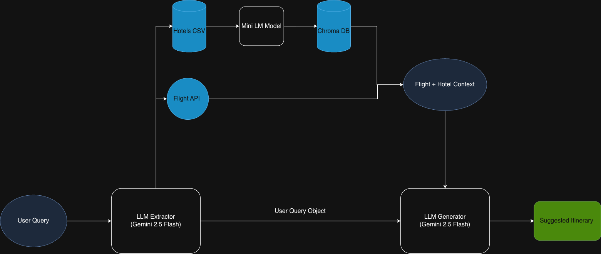
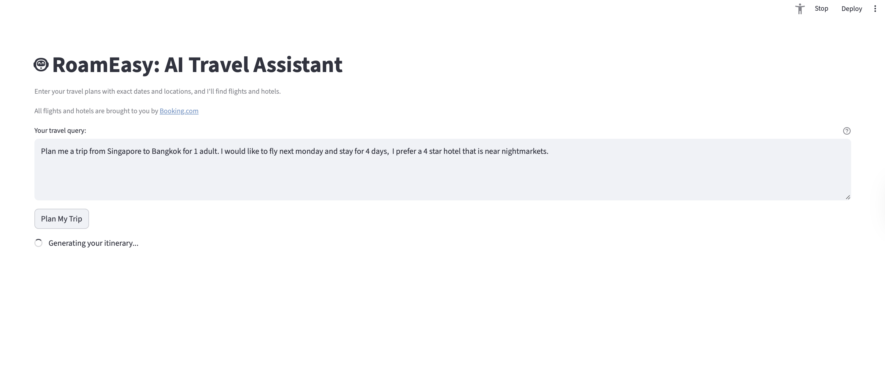
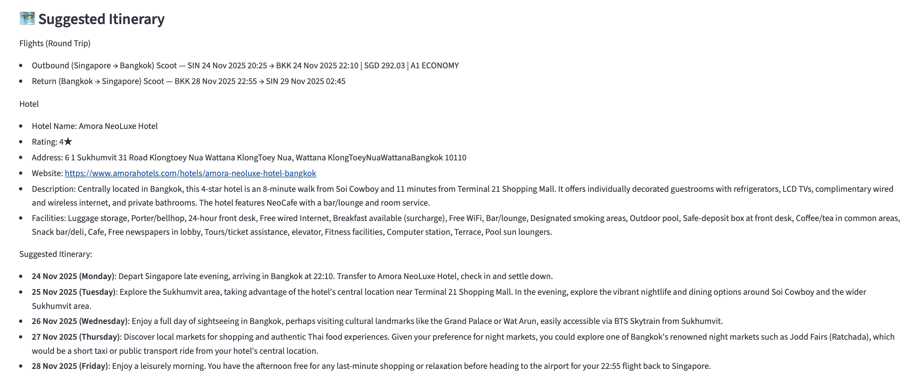
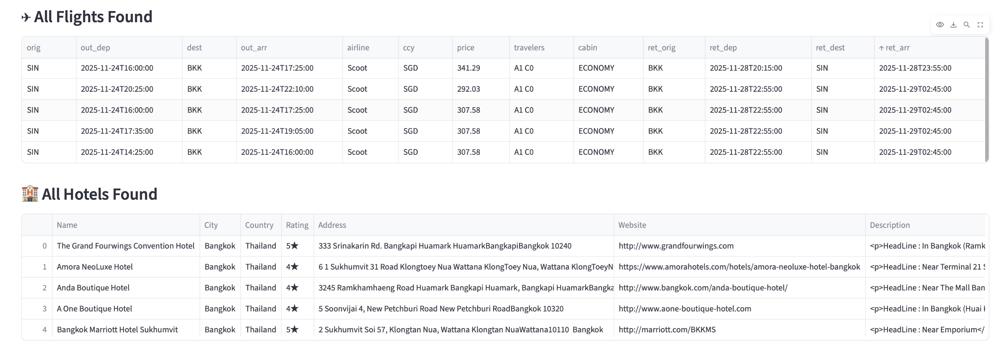

# DSA4213 Travel Planner - RoamEasy

RoamEasy is an AI Travel Assistant powered by **Gemini 2.5 Flash** and **Booking.com** that suggests **flights, hotels, and a draft travel itinerary** from a natural-language user query

## 1. Problem and Motivation
As more travellers rely on publicly available Large Language Models (LLMs) to plan holidays, there is an increasing need for accurate AI travel agents.

RoamEasy addresses this by providing:

* Factual flight and hotel suggestions grounded in real data
* A natural-language interface for specifying preferences (dates, budget, class, amenities, landmarks)

The system is implemented as a Streamlit app and built around an agentic, RAG-enhanced workflow.

---

## 2. System Overview

RoamEasy uses a Retrieval-Augmented Generation (RAG) pipeline:

* **Flights**: retrieved via a live **RapidAPI** flight search tool (Booking.com data)
* **Hotels**: retrieved from a static Booking.com hotels dataset from Kaggle
  (`https://www.kaggle.com/datasets/raj713335/tbo-hotels-dataset` – Booking.com TBO Hotels)

The hotels dataset is embedded by a sentence-embedding model (MiniLM / Sentence-T5 / MPNet) and stored in **ChromaDB**, enabling semantic search over hotel descriptions, facilities, and attractions.

---

## 3. Model Workflow


We developed a RAG integrated, agentic workflow to generate factual flight and hotel itineraries

1. **Trip query parsing (LLM + Pydantic)**
   A prompt-engineered **Gemini 2.5 Flash** model takes the raw user query and extracts structured fields into a **Pydantic class** `TripQuery`, including:

   * origin, destination
   * start/end dates
   * number of adults/children
   * cabin / budget class
   * hotel city/country, minimum stars, and preference text

2. **Data retrieval & filtering**

   * **Flights**

     * Use `TripQuery` attributes to call the **RapidAPI** flight endpoint (Booking.com).
     * Apply filtering logic for dates, class, and time windows (e.g. morning/evening departures).
     * Select the **best flight(s)** based on price.
   * **Hotels**

     * Filter the hotels dataset for the specific country and city.
     * Embed the filtered subset using a transformer-based sentence embedding model (e.g. MiniLM / Sentence-T5).
     * Store embeddings and metadata in **ChromaDB**.

3. **Semantic hotel retrieval**

   * Query ChromaDB using a **preference text** 
   * Combine **semantic similarity** with **hard filters** (min star rating, city, country).
   * Retrieve the **Top-K** most relevant hotels.

4. **Answer generation (LLM with RAG context)**

   * Construct a **context block** with:

     * Top flight candidates (with price, times, cabin, passenger breakdown)
     * Top hotel candidates (with name, rating, address, URL where available)
   * Feed this context plus **formatting rules** into Gemini 2.5 Flash.
   * The model returns:

     * A **suggested round-trip flight**
     * A **suggested hotel**
     * A concise **itinerary-style explanation**

---

## 4. Evaluation Metrics

We evaluate generated itineraries against a manually curated “golden copy” using:

* **BERTScore**
* **METEOR**
* **Critical Fields Analysis** (field-wise discrepancy scoring for flights & hotels)

| Metric                    | Score    |
| ------------------------- | -------- |
| BERTScore                 | 0.86     |
| METEOR                    | 0.43     |
| Critical Fields Analysis* | 2.74 / 5 |

* Critical Fields Analysis: A custom metric rating factual alignment of key fields (e.g. hotel name, rating, city, flight times, price).

### 4.2 Ablation Studies (Embedding Models)

We compared different transformer-based embedding models for hotel retrieval:

| Model       | Precision | MMR   | NDCG  |
| ----------- | --------- | ----- | ----- |
| MiniLM      | 9.9%      | 14.0% | 15.4% |
| MPNet       | 11.6%     | 16.5% | 19.8% |
| Sentence-T5 | 11.9%     | 22.4% | 22.7% |

**Findings**
The model produces semantically appropriate and contextually relevant responses however there is some room to improve wording and fluency (METEOR), but factual errors are relatively limited.
Most mismatches occur in hotel selection, where the search space is large and multiple acceptable options exist. Flight details, which are more objective and constrained, show fewer mismatches, suggesting reasonable factual accuracy on the flight side.

Sentence-T5 achieved the best overall performance across all metrics. This aligns with expectations as Sentence-T5 is explicitly trained for query–passage similarity, whereas MiniLM and MPNet are more tuned for sentence-to-sentence similarity.

---

## 5. Project Structure

### 5.1 Data

* `baseline_responses.csv`
  Model-generated responses used as a baseline for evaluation.

* `golden_copy.csv`
  39 manually curated test queries and reference responses (ground truth) for evaluation.

* `hotels.parquet`
  Static hotels data.

* `flights_data.csv`
  Static flight data for offline tetsing.

---

### 5.2 Notebooks

* `ablation_studies.ipynb`
  Ablation study on the impact of different transformer-based embedding models (MiniLM, MPNet, Sentence-T5) on retrieval performance.

* `evaluation.ipynb`
  Evaluation of **BERTScore**, **METEOR**, and **Critical Fields Analysis** for the model outputs vs golden references.

* `work_flow_v2.ipynb`
  Preliminary notebook testing the RAG workflow and prompt design.

---

### 5.3 Source Code (`src/`)

* `chromadblib.py`

  * Defines the **`ChromaHotelSearch`** class.
  * Handles hotel data embedding and upserting into **ChromaDB**, semantic querying with metadata filters.

* `evals.py`

  * Implements evaluation utilities for **BERTScore**, **METEOR**, and custom critical fields analysis.

* `flight_api.py`

  * Handles calls to the **RapidAPI** (Booking.com) flight endpoint.

* `hotels_utils.py`

  * Utilities for hotel data ingestion and semantic retrieval.

* `main_workflow.py`

    * LLM-based `TripQuery` extraction (Gemini 2.5 Flash)
    * Context construction (flights + hotels)
    * Prompting Gemini 2.5 Flash to produce the final itinerary.

* `travel_agent.py`

  * **Streamlit app** entry point (`streamlit run src/travel_agent.py`).

---

## 6. Getting Started

### 6.1 Dependencies

Load requirements.txt

Create and activate a virtual environment, then install:

```bash
pip install -r requirements.txt
```

### 6.2 Environment / API Keys

You will need:

* A valid **Gemini API key** (for `google.generativeai`)
* A **RapidAPI key** for the Booking.com flight API

Set them as environment variables:

```bash
export GEMINI_API_KEY="your_key_here"
export RAPIDAPI_KEY="your_key_here"
```

---

### 6.3 Running the App

From the project root:

```bash
streamlit run src/travel_agent.py
```

---

## 7. App UI

### 7.1 User Query UI

Users can enter natural-language requests such as:

> “Plan a trip from Singapore to London from 3–17 November 2025,
> 1 adult, premium economy, preferably evening flights and a 4-star hotel near museums.”



---

### 7.2 Suggested Itinerary UI

The app presents:

* Selected outbound and return flights
* A recommended hotel
* A draft itinerary



---

### 7.3 Top 5 Flights and Hotels UI

For comparison, the app also shows:

* Top 5 flight options
* Top 5 hotel options



---
